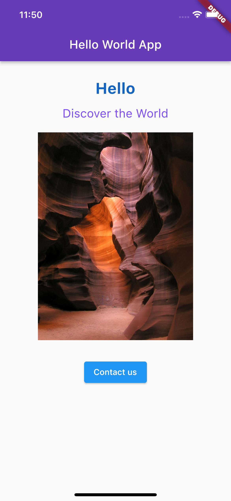
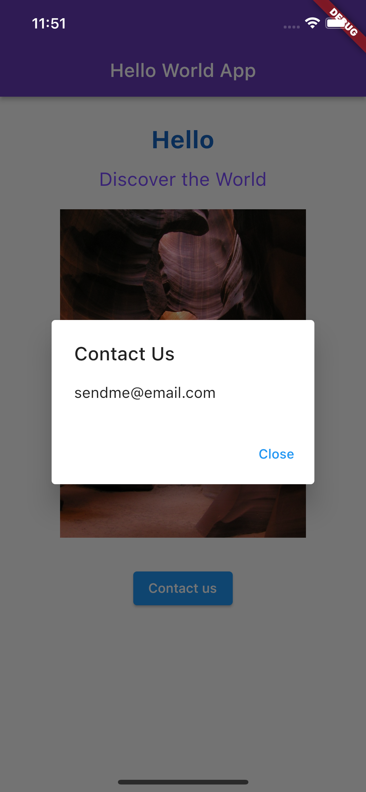

# The Hello World

The necessary first ever flutter project. 

To build it I have followed Packt's [Flutter Projects](https://www.packtpub.com/product/flutter-projects/9781838647773) book, first edition from April 2020. 

## Things Learnt

* Starting flutter apps
* Using [MaterialApp](https://api.flutter.dev/flutter/material/MaterialApp-class.html) and [Scaffold](https://api.flutter.dev/flutter/material/Scaffold-class.html) widgets
* Basics of layout and styling
* Use of [SingleChildScrollView](https://api.flutter.dev/flutter/widgets/SingleChildScrollView-class.html)

## Warnings
* Scroll views are important to allow access to the whole UI in case of overflow, for example due to device rotation.
* [~~RaisedButton~~](https://api.flutter.dev/flutter/material/RaisedButton-class.html) and [~~FlatButton~~](https://api.flutter.dev/flutter/material/FlatButton-class.html) from the book are now deprecated and [ElevatedButton](https://api.flutter.dev/flutter/material/ElevatedButton-class.html) and [TextButton](https://api.flutter.dev/flutter/material/TextButton-class.html) should be used instead. 

## Outcome

Home screen | Popup after clicking the button 
--- | ---
 | 