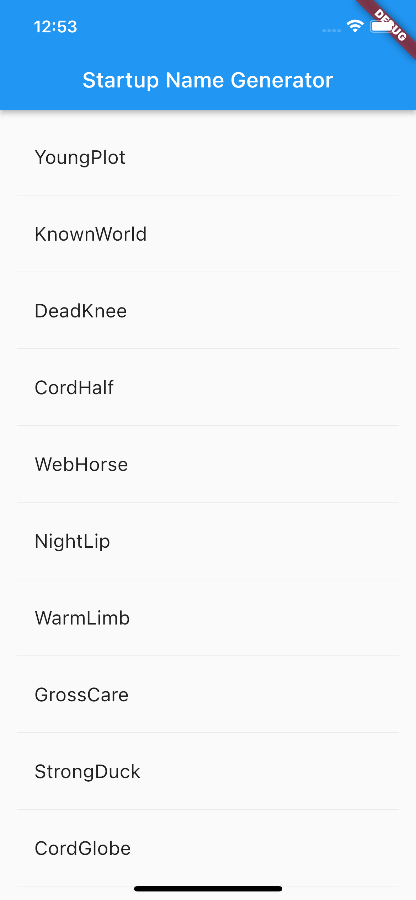

# Startup Namer

A sample first flutter project from Google I/O 2021. 
* [Filip Hracek's walkthrough on YouTube](https://www.youtube.com/watch?v=Z6KZ3cTGBWw) - only the first part
* [Codelab](https://codelabs.developers.google.com/codelabs/first-flutter-app-pt1#0) - full exercise

*So far I have implemented only the ifrst part.*

&nbsp;
## Things Learnt
* [Stateful Widgets](https://api.flutter.dev/flutter/widgets/StatefulWidget-class.html)
* [List View](https://api.flutter.dev/flutter/widgets/ListView-class.html) and [List View Builder](https://docs.flutter.dev/cookbook/lists/long-lists) for long lists.
* `return Container()` in flutter is effectively a `no-op`.
* Widgets produce elements for representation!
* Stateful Widgets are not really that popular - at least shouldn't be. [Inherited Widget](https://api.flutter.dev/flutter/widgets/InheritedWidget-class.html) allow to access state from a widget above in the tree. 

&nbsp;
## Outcome
