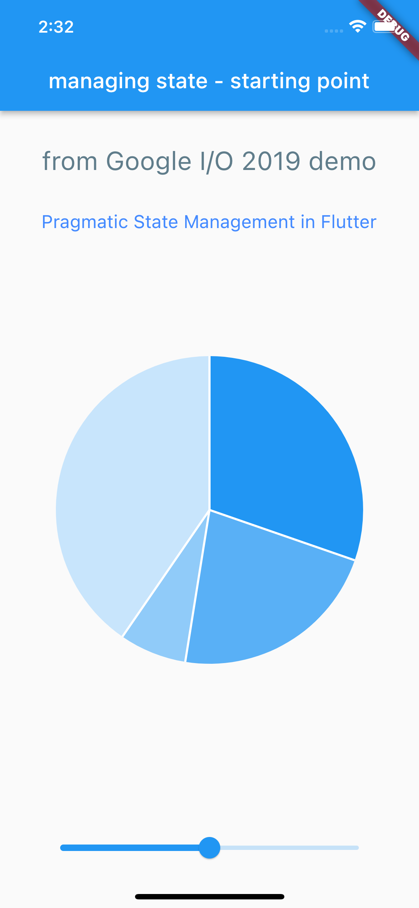
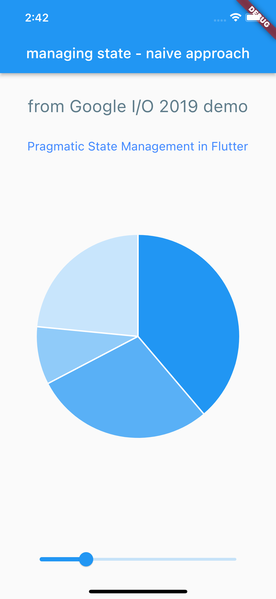
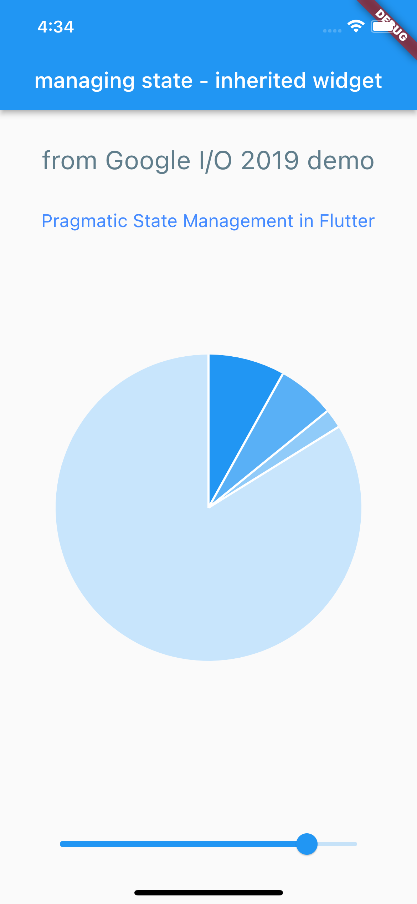
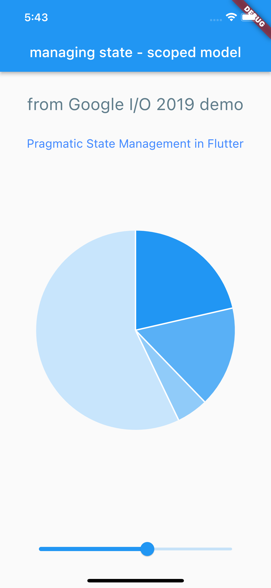
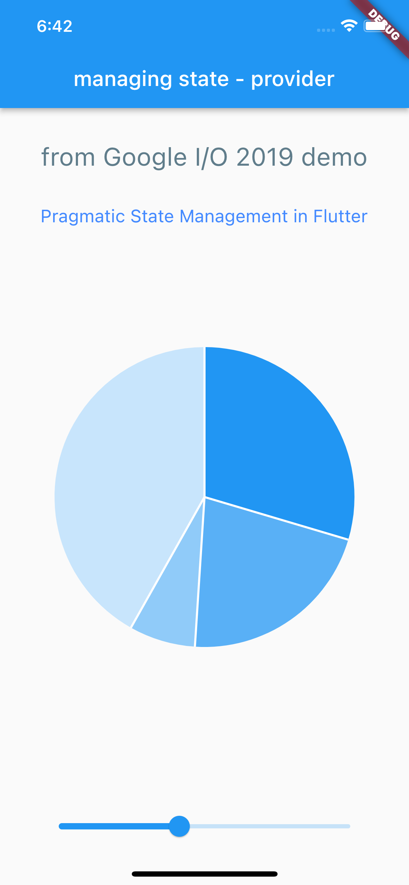
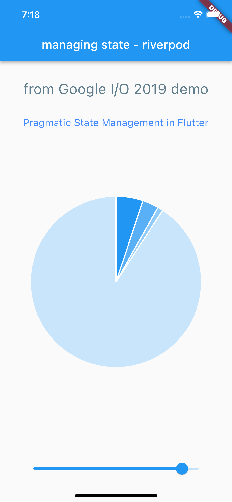

# State experiments

Inspired by the [Pragmatic State management in Flutter]() talk from Google I/O 2019, I have attempted to implement the same basic app demonstrating sate management, using different approaches. 

The outcome is always the same, but the mechanics, and the code are different. I have tried: 

* [Base Project](#base-project)
* [Naive Approach](#naive-approach)
* [Inherited Widget](#inherited-widget)
* [Scoped Model](#scoped-model)
* [Provider](#provider)
* [Riverpod](#riverpod)

| Base | Naive | Inherited | Scoped | Provider | Riverpod |
| --- | --- | --- | --- | --- | --- |
|  |  |  |  |  |  |

There are more approaches to state management influter and they are [well described on flutter.dev](https://docs.flutter.dev/development/data-and-backend/state-mgmt/options). Wider flutter architectures are [presented on fluttersamples.com](https://fluttersamples.com/)

# Implementations

&nbsp;
## Base Project
The [code](./base/) in the base project implements the layout and behaviour of the slider. 
The pie chart does not react to it as there is no state management outside of the slider widget. 

There are three important files in the solution. `main.dart` is the starting point which controls the layout. `char.dart` implements `MyChar`, a pie chart using `charts_flutter` [package](https://pub.dev/packages/charts_flutter) from Google. `slider.dart` implements the `MySlider` widget responsible for the slider at the bottom of the page. 

`main.dart` depends on both `chart.dart` and `slider.dart` but the latter two don't depend on each other.

&nbsp;
## Naïve Approach

Following the [anti-example](./naive/) from the talk, in this naïve approach to state management I store
the chart's state in a global variable. 

```dart
_MyChartState chartState = _MyChartState();

class MyChart extends StatefulWidget {
  @override
  State<MyChart> createState() => chartState;
  
  /* the rest */
}
```

The `_MyChartState class exposes a method to manipulate the value externally:

```dart
void setValue(double value) {
    setState(() { _value = value; });
}
```

And the slider, from its state change handler can change chart's state.

```dart
void _valueChanged(double value) {
    setState(() { _value = value; });
    chartState.setValue(value);
}
```


&nbsp;
## Inherited Widget

Another approach, is to hoist the model to a place in the element tree that is common to all of the elements. 

Classes like [Inherited Widget](https://api.flutter.dev/flutter/widgets/InheritedWidget-class.html) and [Inherited Notifier](https://api.flutter.dev/flutter/widgets/InheritedNotifier-class.html) help to implement this pattern as seen in the [sample code](./inherited).

The main advantage is, that the widgets below in the tree can be stateless.

But this comes with an addition of two new classes defined in `model.dart`:

```dart
class HomeModel extends InheritedNotifier<HomeState> {
  HomeModel({
    Key? key,
    required HomeState notifier,
    required child
  }) : super(key: key, notifier: notifier, child: child);

  HomeState state = HomeState();

  @override
  bool updateShouldNotify(covariant HomeModel oldWidget)
  => state.size != oldWidget.state.size;

  static HomeState of(BuildContext context) {
    return context.dependOnInheritedWidgetOfExactType<HomeModel>()?.notifier
      ?? HomeState();
  }
}
```

```dart
class HomeState extends ChangeNotifier {
  double _size = 0.0;

  double get size => _size;

  set size(double value) {
    _size = value;
    notifyListeners();
  }
}
```

With the above, the `Home` widget becomes stateful, to hold the state. 

```dart
class Home extends StatefulWidget {
  @override
  State<Home> createState() => _HomeState();
}

class _HomeState extends State<Home> {
  HomeState state = HomeState();

  @override
  Widget build(BuildContext context) {
    return HomeModel(
      notifier: state,
      child: Scaffold(/*....*/)
    )
  }
```

&nbsp;
## Scoped Model

[This implementation](./scoped/) of state uses the [scoped_model](https://pub.dev/packages/scoped_model) package. Similartly to the [Inherited Widget](#inherited-widget) above it requires a model/state class to be defined but this time it is much simpler: 

```dart
class MyModel extends Model {
  double _size = 0.0;

  double get size => _size;

  set size(double value) {
    _size = value;
    notifyListeners();
  }
}
```

With that, all of my widgets can remain stateless. The state provider is introduced by adding the `ScopedModel<T>` widget in the tree, in my case in the `main.dart`: 

```dart
class Home extends StatelessWidget {
  @override
  Widget build(BuildContext context) {
    return ScopedModel<MyModel>(
      model: MyModel(),
      child: Scaffold(/*...*/)
    );
  }
```

And because the state is provided, both `MyChart` and `MySlider` can now remain stateless, but they have to include `ScopedModelDependant<T>` to consume the model provided by the `ScopedModel<T>` widget higher up the tree. 

```dart
class MySlider extends StatelessWidget {
  @override
  Widget build(BuildContext context)
    => ScopedModelDescendant<MyModel>(
      builder: (context, child, model) => Slider(
            value: model.size,
            onChanged: (value) => model.size = value
        )
    );
}
```

```dart
class MyChart extends StatelessWidget {
  @override
  Widget build(BuildContext context)
    => ScopedModelDescendant<MyModel>(
        builder: (context, child, model)
            => charts.PieChart(_createData(model.size), animate: false)
    );
}
```

That's really or there is in the Scoped Model approach to state management. 


&nbsp;
## Provider

[Implementation](./provider/) of state management with the [Provider](https://pub.dev/packages/provider) package is very similar to the last two. The model class is exactly the same as in the *Inherited Widget* approach, and extends from `ChangeNotifier`, but without the need to also extend `InheritedNotifier` widget. 

```dart
class MyModel extends ChangeNotifier {
  double _size = 0.0;
  double get size => _size;
  set size(double value) {
    _size = value;
    notifyListeners();
  }
}
```

The recommendation is then to plug the state provider right at the top of the widget tree like so:

```dart
void main() {
  runApp(ChangeNotifierProvider(
    create: (context) => MyModel(),
    child: const SampleStateApp()
  ));
}
```

Then, to consume or interact with the state `Consumer<T>` widget has to be used, with recommendation to use it as far down in the tree as possible. Widgets remain stateless. 

```dart
class MySlider extends StatelessWidget {
  @override
  Widget build(BuildContext context)
    => Consumer<MyModel>(
      builder: (context, model, child)
          => Slider(
            value: model.size,
            onChanged: (value) => model.size = value
          )
    );
}
```

```dart
class MyChart extends StatelessWidget {
  const MyChart({Key? key}) : super(key: key);

  @override
  Widget build(BuildContext context)
    => Consumer<MyModel>(
      builder: (context, model, child)
          => charts.PieChart(_createData(model.size), animate: false,)
    );
}
```

&nbsp;
## Riverpod 

First immutable state management [implementation](./riverpod/) uses the [flutter_riverpod](https://pub.dev/packages/flutter_riverpod) package, based on [riverpod](https://riverpod.dev/).

The model is very simple but it is immutable:

```dart
@immutable
class MyModel {
  final double size;
  MyModel(this.size);
}
```

However, to manage it, and notify the widgets about the state changes, it has to be accompanied by `StateNotifier<MyModel>` implementation and a global state provider - that's how Riverpod works, and so my `model.dart` file now also has: 

```dart
class MyStateNotifier extends StateNotifier<MyModel> {
  MyStateNotifier() : super(MyModel(0.5));
  void set(double value) {
    state = MyModel(value);
  }
}

final stateProvider = StateNotifierProvider<MyStateNotifier, MyModel>((ref) => MyStateNotifier());
```

To start using the above, we need to have the main application wrapped in the `ProviderScope` widget. 

```dart 
void main() {
  runApp(const ProviderScope(child: SampleStateApp()));
}
```
And with that addition, state consumption is as easy as: 

```dart
class MyChart extends ConsumerWidget {
  @override
  Widget build(BuildContext context, WidgetRef ref) {
    return charts.PieChart(_createData(ref.watch(stateProvider).size), animate: false,);
  }
}
```

Unfortunately, the updates look not so elegant: 

```dart
class MySlider extends ConsumerWidget {
  @override
  Widget build(BuildContext context, WidgetRef ref) {
    MyModel state = ref.watch(stateProvider);
    return Slider(
            value: state.size,
            onChanged: (value) => ref.read(stateProvider.notifier).set(value)
      );
  }
}
```

But as the changes have to be implemented through a method calls, it is a very helpful method of state management for any system based on events rather than direct mutations. 